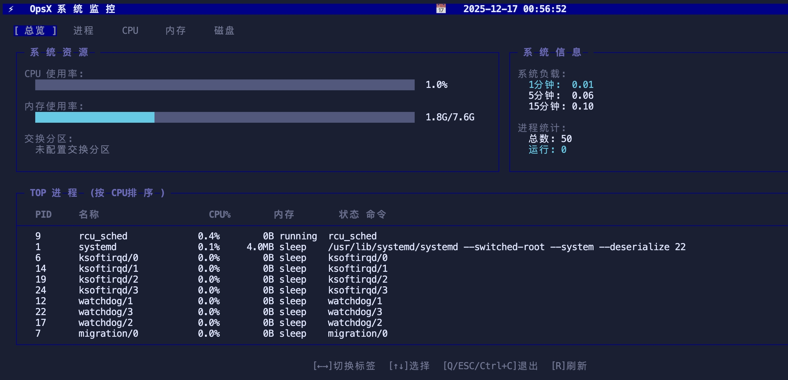
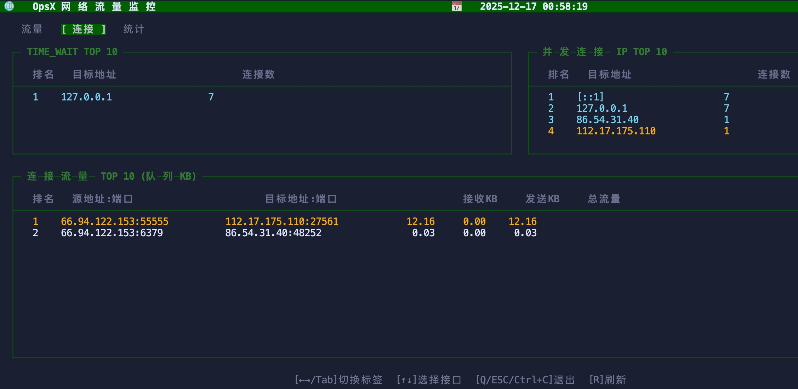

# opsxcli - 运维瑞士军刀 | 一站式命令行工具集

面向运维和开发的集成化命令行工具,**一条命令操作 MySQL、Redis、SSH、Docker、Kubernetes 等服务**。

## ✨ 核心特性

- 🚀 **多合一工具**: 整合数据库、网络、系统、容器编排等 70+ 命令
- ⚡ **实时监控**: 网络和系统监控终端设计
- 📦 **网络工具**: 替代 iproute、net-tools 等常用包
- 🐳 **容器加速**: Docker 镜像自动加速、多源极速、断点续传
- ☸️ **K8s 集成**: kubectl 代理、服务发现、资源管理

## 🛠️ 主要功能

### 💾 数据库工具
- **mysql**: MySQL 交互式 Shell 和命令执行
- **psql**: PostgreSQL 数据库操作
- **redis**: Redis 单机/集群操作

### 🌐 网络工具
- **ssh**: SSH 连接、命令执行、文件传输、端口转发
- **ping**, **traceroute**, **telnet**, **nc**: 连通性测试
- **ss**, **netstat**, **nmap**: 连接状态和端口扫描
- **ifconfig**, **route**, **ip**: 接口和路由管理

### 🐳 Docker & Kubernetes
- **docker pull**: 镜像拉取(自动加速、多源极速、断点续传)
- **kubectl**: kubectl 命令行代理
- **consul**: K8s 服务发现并注册到 Consul
- **kubernetes**: K8s 资源管理(YAML 生成、资源操作)

### 📊 实时监控 (TUI)
- **sys**: 系统监控(CPU/内存/磁盘/进程)
- **net**: 网络监控(流量/连接/状态统计)

### 🖥️ 系统工具
- **ps**, **top**, **kill**, **free**, **df**: 进程和资源管理
- **tar**, **gzip**, **unzip**: 压缩和解压

### 📁 文件操作 (Busybox 兼容)
- **ls**, **cat**, **grep**, **vi**, **vim**, **tree**: 文件查看
- **cp**, **mv**, **rm**, **mkdir**, **chmod**: 文件管理
- **awk**, **sed**: 文本处理

<details>
<summary>📋 查看完整命令列表 (70+ 命令)</summary>

使用 `opsxcli <command> --help` 查看具体命令的帮助信息。

**文件操作**: ls, cat, grep, vi, vim, more, less, head, tail, cp, mv, rm, mkdir, rmdir, touch, tree, chmod, chown, ln, awk, sed

**系统工具**: ps, top, kill, pstree, free, df, du, uname, hostname, whoami, id, mount, umount, date, sleep, watch

**网络工具**: ssh, ping, traceroute, telnet, nc, ss, netstat, nmap, ftp, tftp, ifconfig, route, ip

**压缩工具**: tar, gzip, unzip

**服务端**: server (HTTP/WebSocket/gRPC)

**实用工具**: wget, request, install, upgrade

</details>

## 快速安装

### 自动下载最新版本

```bash
# 使用 wget
wget "https://gitee.com/opsx-tools/opsxcli/releases/download/latest/opsxcli-$(uname -s)-$(uname -m).tar.gz"

# 或使用 curl
curl -L -o opsxcli-$(uname -s)-$(uname -m).tar.gz \
  "https://gitee.com/opsx-tools/opsxcli/releases/download/latest/opsxcli-$(uname -s)-$(uname -m).tar.gz"

# 解压并安装
tar -xzf opsxcli-*.tar.gz
chmod +x opsxcli
sudo mv opsxcli /usr/local/bin/
```

**注意**: Windows 用户请访问 [Releases 页面](https://gitee.com/opsx-tools/opsxcli/releases) 下载对应的 `.zip` 文件

## 使用示例

### 数据库操作

```bash
# MySQL 交互式 shell
opsxcli mysql -u root -h localhost -p

# 执行 SQL
opsxcli mysql -u root -p "password" -h localhost -e "SELECT VERSION()"

# Redis 交互式 shell
opsxcli redis -h 127.0.0.1 -a password

# Redis 集群连接
opsxcli redis -h 127.0.0.1 -p 6001 -c -a password

# Redis 操作
opsxcli redis get mykey -h 127.0.0.1
opsxcli redis set mykey "myvalue" -h 127.0.0.1
```

### SSH 远程操作

```bash
# 交互式登录
opsxcli ssh root@172.16.1.123
opsxcli ssh -i ~/.ssh/id_rsa root@opsx.vip  -p55555

# 执行命令
opsxcli ssh root@172.16.1.123 "ls -la"

# 上传/下载文件
opsxcli ssh put /local/file.txt root@172.16.1.123:/remote/file.txt
opsxcli ssh get root@172.16.1.123:/remote/file.txt /local/file.txt

# 端口转发
opsxcli ssh forward local 8080:localhost:80 root@172.16.1.123
```

### Docker 镜像加速

```bash
# 拉取单个镜像(自动加速)
opsxcli docker pull nginx:latest

# 并发拉取多个镜像
opsxcli docker pull nginx:latest redis:alpine mysql:8.0

# 自定义镜像源
opsxcli docker pull nginx:latest -r docker.aityp.com -r docker.1ms.run -c 5
```

### 系统监控 

```bash
# 进入系统监控界面(2秒实时刷新)
opsxcli sys

# 快捷键:
# Tab: 切换视图 (概览/CPU/内存/磁盘/进程)
# C/M/D: 按 CPU/内存/磁盘IO 排序
# ↑↓: 选择进程  |  q: 退出

# 网络监控界面
opsxcli net
# Tab: 切换视图 (概览/连接/统计)
# 显示实时速率、活跃连接TOP10、连接状态统计
```

### Kubernetes 服务管理

```bash
# 在kubectl主机上运行，自动搜索集群所有svc的metrics接口并注册服务到 Consul
opsxcli consul -s https://consul.example.com:8500 -m /actuator/prometheus
opsxcli consul -s https://consul.example.com:8500 -m /actuator/prometheus

# 清理失效实例
opsxcli consul -s https://consul.example.com:8500 --clean
```

### 网络连接分析

```bash
# 查看所有 TCP/UDP 连接
opsxcli ss -tunap

# TCP 状态统计
opsxcli ss -ant --stats

# 目标地址 TOP 10
opsxcli ss -an --top 10

# TIME_WAIT 状态分析
opsxcli ss -tan --timewait
```

## 📸 界面预览

### 系统监控 (sys)



### 网络监控 (net)



## 🔄 自动升级

保持工具始终最新:

```bash
# 检查并升级到最新版本; 权限不够时请使用sudo
opsxcli upgrade
```

升级命令会自动:
- 检测当前系统和架构
- 从 Gitee Releases 获取最新版本
- 下载并替换当前执行文件
- 保留所有配置和数据

## 许可证

MIT License
